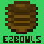
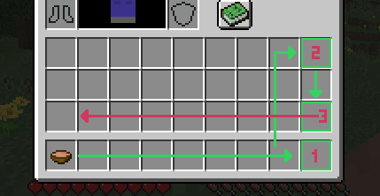

# EZBOWLS

  

MOD NEEDS TO BE INSTALLED SERVERSIDE TO FUNCTION

---

When you eat a stew or soup in game, the empty bowl will be automatically moved to a stack of bowls somewhere else in your inventory.
If you eat a stew or soup and there isn't already an available stack of bowls in your inventory, the new empty bowl will try to go into 
either the end of yourtool bar, the top right of youe inventory, or the last empty inventory space available in that order.

  

---
  
## How To Use

Eat some mushroom stew, or rabbit stew, or beet soup.

## License

ezbowls is licensed under the CC0 license. Feel free to use it.
